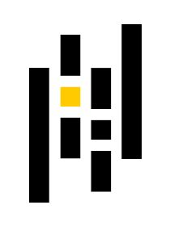
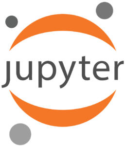
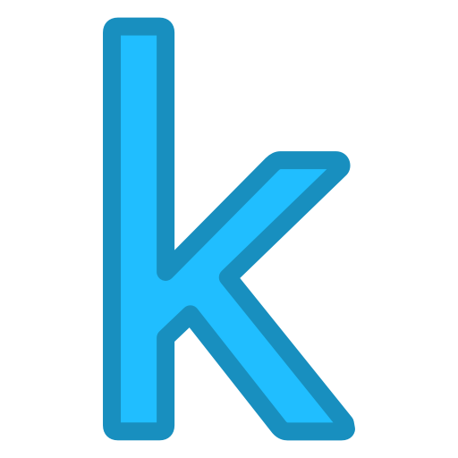

### Hi there, I'm Aniket Bharti - aka AniketARS 👋

## I'm a Learner, Developer, and Practitioner!!

- 🌱 I’m currently learning everything 🤣
- 👯 I’m looking to collaborate with other content creators
- 🥅 2021 Goals: Contribute more to Open Source projects

---

### Languages and Tools:

 
 

---

### Connect with me:

[][linkedin]
[][kaggle]
[][instagram]

 

---

### GitHub Projects:

- Computer Vision Nanodegree Projects:
  1. [Facial Keypoints Detection](https://github.com/AniketARS/CVND-Facial-Keypoints-Detection/blob/main/README.md)
  2. [Image Captioning](https://github.com/AniketARS/CVND-Image-Captioning-COCO/blob/main/README.md)
  3. [Landmarks Detection and Mapping (SLAM)](https://github.com/AniketARS/CVND-Landmarks-Detections-and-Mapping/blob/main/README.md)

[instagram]: https://instagram.com/aniket__ars
[linkedin]: https://linkedin.com/in/aniketars
[kaggle]: https://www.kaggle.com/codears
